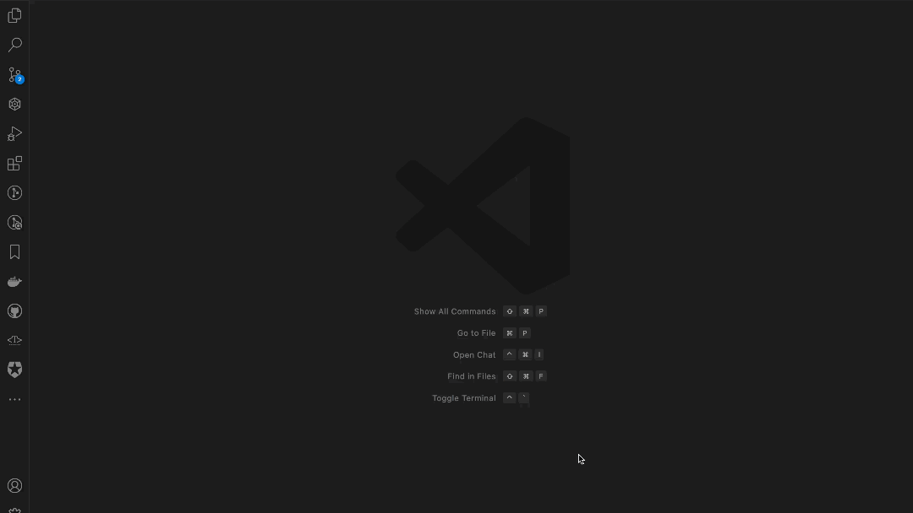

# Git AI Assistant

A VS Code extension that generates PR descriptions and commit messages using AI (AWS Bedrock Claude or Google Gemini).

   
## Features

- Automatically generates PR descriptions based on your local git diffs
- Supports multiple AI providers:
  - AWS Bedrock with Claude models
  - Google Gemini models
- Supports customizable PR templates
- Opens the generated PR description in a new editor tab so you can review and edit it
- Convenient sidebar panel for quick access to all features
- Easy configuration UI for AI provider credentials
- Modular architecture for easy addition of more AI providers in the future

## Requirements

- Visual Studio Code 1.60.0 or higher
- Git installed and accessible from the command line
- One of the following:
  - AWS account with access to Bedrock and Claude
  - Google API key with access to Gemini models

## Installation

1. Install the extension from the VS Code Marketplace
2. Configure your preferred AI provider credentials through the sidebar panel

## Usage

### Using the Sidebar Panel

1. Click on the Git AI Assistant icon in the VS Code Activity Bar (left sidebar)
2. In the sidebar panel, click on:
   - "Configure AWS Credentials" to set up your AWS access
   - "Configure Google Credentials" to set up your Google API key
   - "Generate PR Description" to create a PR description

### Using Commands

1. Make changes to your code and stage them with git
2. Open the command palette (Ctrl+Shift+P or Cmd+Shift+P)
3. Run the command "Generate PR Description and Commit Message"
4. Review and edit the generated description in the new editor tab
5. Copy the description to your PR when ready

## Configuration

This extension supports multiple AI providers that you can configure:

### Google Gemini

#### Using the Configuration UI
1.  Get an API key for Gemini here: https://aistudio.google.com/apikey
2. Click on "Configure Google Credentials" in the sidebar panel
3. Enter your Google API Key

4. Select your preferred Gemini model:
   - Gemini 1.5 Flash (default)
   - Gemini 1.5 Flash 8B (smaller model)
   - Gemini 2.0 Flash (experimental)
5. Click "Save Credentials & Use Google Gemini"

   

#### Using Settings

You can also configure these settings in VS Code settings:

```json
{
  "gitAIAssistant.modelProvider": "google-gemini",
  "gitAIAssistant.googleApiKey": "YOUR_GOOGLE_API_KEY",
  "gitAIAssistant.googleGeminiModel": "gemini-1.5-flash",
  "gitAIAssistant.defaultPRTemplate": "## Summary\n\n## Changes\n\n## Testing\n\n## Screenshots\n\n"
}
```

### Diff Source Configuration

You can choose between two sources for generating PR descriptions:

1. **Staged Changes** (default): Uses the currently staged changes in your git repository
2. **Recent Commits**: Uses a specific number of recent commits

#### Using the Configuration UI

1. Click on "Configure Settings" in the sidebar panel
2. Scroll down to the "PR Description Source" section
3. Select either "Staged Changes" or "Recent Commits"
4. If you select "Recent Commits", specify the number of commits to include (1-20)
5. Click "Save Configuration"

#### Using Settings

You can also configure these settings in VS Code settings:

```json
{
  "gitAIAssistant.diffSource": "staged", // or "commits"
  "gitAIAssistant.commitCount": 1 // Number of commits to consider when diffSource is "commits"
}
```

## License

MIT 


